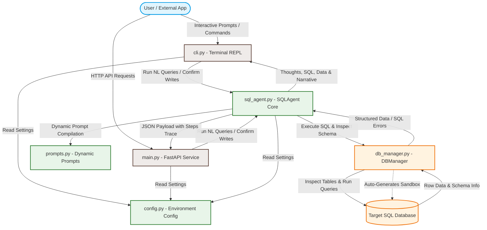
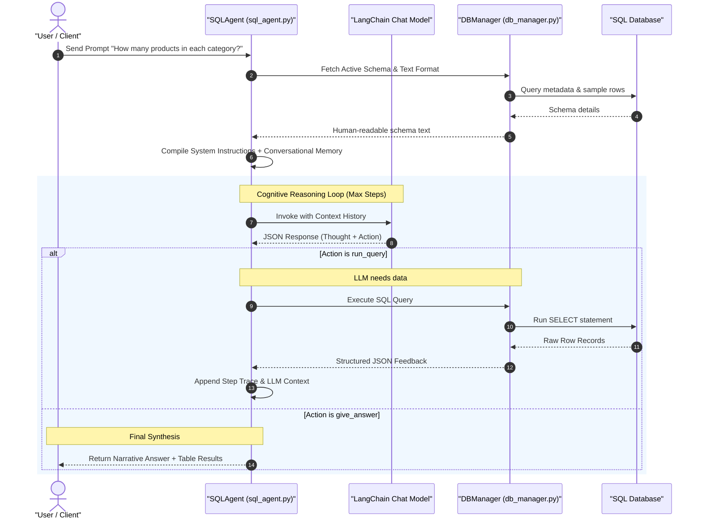
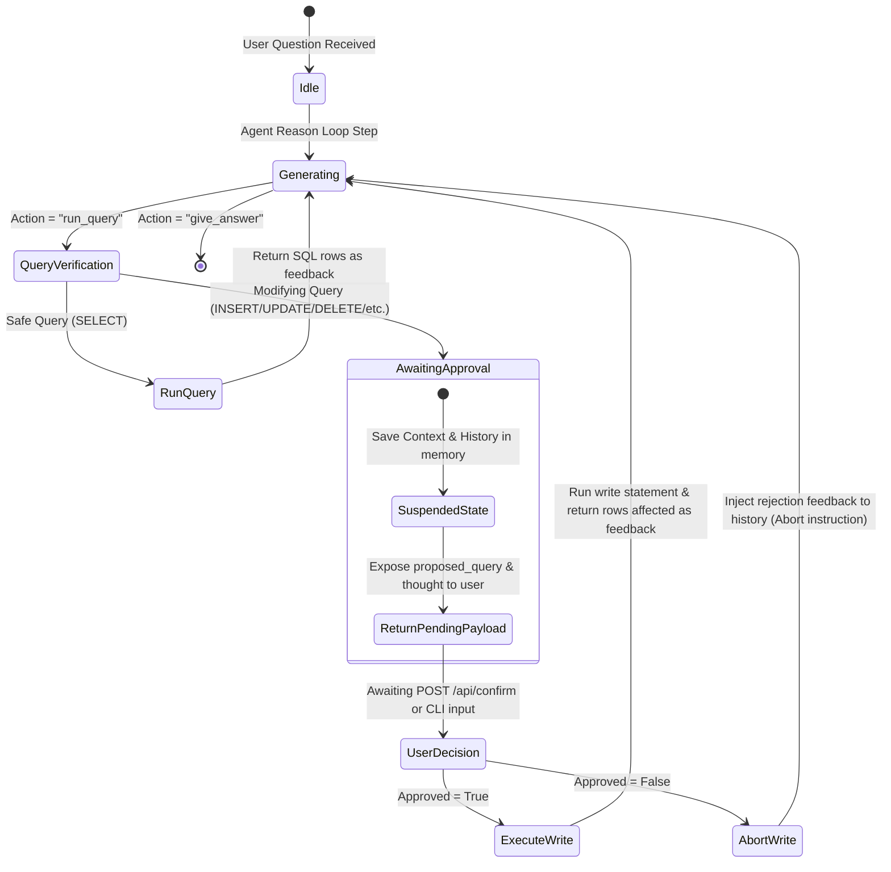

# 🔷 SQL AI Agent: Comprehensive Architecture & System Report

Welcome to the comprehensive technical report for the **SQL AI Agent**. This document provides an in-depth, production-grade review of the application's architecture, design patterns, security mechanisms, database managers, and LLM orchestration flow.

---

## 🎯 Executive Summary

The **SQL AI Agent** is a state-of-the-art, secure, and production-ready natural language database interface. It bridges the gap between non-technical business stakeholders and relational database engines by automatically translating plain English prompts into highly optimized, dialect-specific SQL queries. It executes these queries safely, recovers from syntactic or relational errors on the fly using a self-correcting cognitive loop, and returns both structured raw records and conversational, data-driven summaries.

Designed with **zero-UI** paradigms in mind, the platform provides two main user-facing interfaces:
1. **Interactive Terminal CLI Shell (cli.py)**: A rich, ANSI-colored REPL featuring schema inspection, conversational history, raw SQL modes, and step-by-step agent traces.
2. **Robust FastAPI REST API Gateway (main.py)**: A fully typed, production-ready REST service enabling enterprise application integrations, with a stateless suspend-and-resume write-confirmation workflow.

---

## 🏗️ System Architecture & Separation of Concerns

The codebase is built on strict software engineering principles, emphasizing modular design, single responsibility, and decoupled component architecture.



### 🗂️ File-by-File Responsibility Matrix

| File Name | Architectural Role | Key Functions & Responsibilities |
| :--- | :--- | :--- |
| [config.py](file:///d:/poc/agent-ai/custom-agent/config.py) | **Configuration Manager** | Reads, parses, and validates environment variables. Exposes typed configurations for LLM providers (Gemini, OpenAI, Claude, Grok), temperatures, max reasoning steps, row caps, and connection details. |
| [db_manager.py](file:///d:/poc/agent-ai/custom-agent/db_manager.py) | **Data Access Layer (DAL)** | Manages SQLAlchemy connections. Inspects dynamic schemas, generates inferred relationships, executes read-only or read-write queries, enforces result caps, and bootstraps SQLite sandbox databases. |
| [prompts.py](file:///d:/poc/agent-ai/custom-agent/prompts.py) | **Prompt Engineering Module** | Compiles system instructions based on SQL dialect, target schema, and security modes. Enforces JSON output guidelines, safety constraints, and updates verification rules. |
| [sql_agent.py](file:///d:/poc/agent-ai/custom-agent/sql_agent.py) | **Orchestration Core** | Implements the multi-provider LLM factory and the main cognitive reasoning loop. Tracks agent trace steps, handles conversational memory (context retention), and manages pending write states. |
| [cli.py](file:///d:/poc/agent-ai/custom-agent/cli.py) | **Presentation Layer (Terminal)** | Runs an interactive colored CLI REPL. Implements commands like `/schema`, `/history`, `/clear`, `/sql`, and custom interactive confirmation dialogues for modifying queries. |
| [main.py](file:///d:/poc/agent-ai/custom-agent/main.py) | **Presentation Layer (Web)** | Exposes a FastAPI REST API with endpoints `/api/status`, `/api/schema`, `/api/chat`, `/api/confirm`, and `/api/execute`. Implements standard Pydantic models and full CORS support. |
| [test_write_safety.py](file:///d:/poc/agent-ai/custom-agent/test_write_safety.py) | **Quality Assurance / Test Suite** | Validates the agent's behavior under edge cases: blocks mock data inserts, triggers SELECT checks before update operations, and checks write safety rules. |

---

## 💾 Database Engine & Schema Discovery (`db_manager.py`)

The `DBManager` class is a high-performance database wrapper designed to interact seamlessly with major relational database systems: **SQLite, PostgreSQL, MySQL, and Microsoft SQL Server (MSSQL)**.

### 🌟 Dynamic Schema Inspection & Metadata Extraction
Unlike standard chat assistants that rely on hardcoded database documentation, `DBManager` interrogates the database at runtime using SQLAlchemy's inspection engine (`inspect(self.engine)`):
1. **Schema Retrieval**: Identifies active, non-system schemas (e.g., filtering out standard system schemas like `information_schema` and `pg_catalog` in PostgreSQL).
2. **Column Inspection**: Retrieves precise data types, nullability, and primary key status for every table column.
3. **Foreign Key Mapping**: Extracts structural relationships and constraint maps linking columns to parent tables.
4. **Estimated Row Counts**: Executes lightweight dialect-specific optimizations (such as querying `pg_class` in PostgreSQL to retrieve table statistics) or falls back to `COUNT(*)` to report table volume.
5. **Sample Data Extraction**: Performs a fast `SELECT * LIMIT 2` on each table to fetch actual records, demonstrating date formats, identifier values, and typical column distributions to the LLM.

### 🔮 Custom Relationship Inference (Heuristics Engine)
In many real-world legacy databases, physical foreign key constraints are not explicitly declared in the DDL, despite logical relationships existing in the queries. `DBManager` addresses this by applying a naming convention heuristic engine:
- If a column's name ends with `_id` or `id` (and is not a primary key), the engine searches for parent tables containing corresponding terms (e.g., a column `customer_id` or `customerid` is mapped to tables `customers` or `customer`).
- It maps these relationships as **Inferred/Potential Relationships (Implicit)** and feeds them to the LLM alongside standard constraints, dramatically improving multi-table join synthesis.

### 🏝️ Auto-Seeding SQLite Sandbox
To allow developers to evaluate the agent instantly, `DBManager` contains an automatic seeding sequence. If target database settings are omitted or a missing SQLite database is specified:
1. It initializes an SQLite database file `sample_ecommerce.db`.
2. It generates a realistic, highly relational 4-table E-commerce schema: `customers`, `products`, `orders`, and `order_items`.
3. It seeds tables with high-fidelity, interconnected sample data (10 customers, 12 products, and 15 multi-item orders) containing realistic status codes, pricing, and dates.

---

## 🧠 LLM Orchestration & Reasoning Loop (`sql_agent.py`)

At the core of the **SQL AI Agent** is a step-by-step cognitive reasoning loop powered by LangChain and Google Gemini.



### 🛠️ Multi-Provider LLM Factory
The agent supports multiple state-of-the-art reasoning models out of the box using standard LangChain wrappers:
*   **Google Gemini** (via `ChatGoogleGenerativeAI`, default model `gemini-2.5-flash`)
*   **OpenAI GPT** (via `ChatOpenAI`, default model `gpt-4o`)
*   **Anthropic Claude** (via `ChatAnthropic`, default model `claude-opus-4-5`)
*   **xAI Grok** (via an OpenAI-compatible endpoint mapping to `grok-3`)

The factory is designed to support deterministic generations by pinning `LLM_TEMPERATURE = 0.0`.

### 🧩 Cognitive Error Self-Correction
If the LLM generates a SQL query that triggers a database-level error (e.g., referring to a missing column, using an invalid function, or generating a syntax error), the system does not crash or report failure to the user.
1. The exception is intercepted by the `DBManager`.
2. The raw database error string is structured into an error feedback block (`QUERY_ERROR_FEEDBACK`).
3. This feedback is appended to the conversational history as a system message.
4. The agent executes another loop step, passing the error logs back to the LLM.
5. The LLM reads the error, synthesizes why it failed, generates a corrected SQL statement, and attempts execution again.

### 💬 Memory Context Management
The agent features conversational context memory, storing up to `MEMORY_MAX_TURNS` (default `10`) previous turns as human/assistant chat history. When the user asks a follow-up question (e.g., "Which of those live in Chicago?"), the agent automatically appends the previous questions and responses to the context window, enabling fluid multi-turn SQL generation.

---

## 🔒 Write-Safety & Confirmation Workflows

Security is the primary consideration when interfacing LLMs with relational databases. The system implements a multi-layered security framework protecting the target database from accidental edits, data loss, or unauthorized injections.

### 🛡️ Layer 1: Application-Level Keyword Analysis
Before executing any query on the database connection, the query string is analyzed by the `DBManager`'s safety filter. The query is stripped of single-line and multi-line comments, capitalized, and searched for database-modifying keywords:
```python
write_keywords = ["INSERT", "UPDATE", "DELETE", "DROP", "ALTER", "CREATE", "REPLACE", "TRUNCATE", "RENAME"]
```
If `READ_ONLY=True` is enabled in config, any query matching these keywords is instantly blocked, throwing a `PermissionError` before touching the network socket.

### 🤝 Layer 2: Stateless Write-Confirmation State Machine
If the system is running in **READ-WRITE** mode, the agent allows modifying operations but forces them through an interactive confirmation protocol.



1. **State Suspension**: If the LLM proposes a database-modifying query, the reasoning loop halts immediately.
2. **Context Persistence**: The agent saves the entire conversation state—including the current reasoning steps, complete thought history, proposed query, and prompt data—into a transient variable `self.pending_write`.
3. **Suspension Payload**:
    *   **REST API**: `/api/chat` returns an HTTP response containing `"requires_confirmation": true`, `"proposed_query": "..."`, and the agent's `"thought"`.
    *   **CLI Mode**: The CLI shell halts and displays a colorful, high-impact warning box showing the proposed SQL and thought process, requesting a `yes/no` response.
4. **Resuming Execution**:
    *   **If Approved**: The query executes, and the database response (e.g., number of affected rows) is injected into the history. The reasoning loop resumes, allowing the LLM to complete its reasoning and formulate a friendly final response.
    *   **If Aborted**: The query execution is completely cancelled. The agent receives a simulated human message stating that the user rejected the write. The agent resumes reasoning to explain the rejection and ask for alternative commands.

### 📋 Layer 3: Interactive Prompt Instructions (Prompt-Level Guards)
In `prompts.py`, the agent is fed strict operating guidelines that adapt dynamically based on security status:
*   **Production Safeguards**: Emphasizes that write operations are taking place in a live database, forbidding mock/guessed values.
*   **Pre-verification SELECT**: Instructs the agent that before executing any `UPDATE` or `DELETE`, it must first run a `SELECT` query to verify that the targeted record exists.
*   **Primary Key Targets**: Directs the agent to always use precise `WHERE` clauses targeting specific, verified primary keys (e.g., `WHERE id = 123`) to prevent broad, unconstrained updates or deletes.
*   **Relationship Integrity**: Instructs the agent to check parent tables for foreign keys before running inserts, preventing database integrity check failures.

---

## 🌐 FastAPI REST API Service Gateway (`main.py`)

The REST service is a fully documented, robust gateway designed to expose the SQL agent's capabilities to web frontends, mobile applications, or internal microservices.

### 🛣️ Endpoint Specification

```
🔷 SQL AI Agent API (v1.1.0)
├── 📂 Database Metadata
│   ├── GET  /api/status     - Returns database connection status, dialect, tables, and rich schema structure
│   └── GET  /api/schema     - Returns raw formatted database schema text block given to the LLM context
│
├── 📂 AI Agent Conversations
│   ├── POST /api/chat       - Processes natural language commands, returns answers, steps, and confirmation requests
│   └── POST /api/confirm    - Approves or denies a pending database-modifying query to resume execution
│
└── 📂 Raw SQL Execution
    └── POST /api/execute    - Directly executes raw SQL queries, respecting connection and read-only settings
```

### 🧬 High-Fidelity Data Contracts (Pydantic Schemas)

The API defines comprehensive data validation contracts:

#### 1. `StatusResponse`
Exposes the database properties, table names, and the rich schema object structure:
```json
{
  "connected": true,
  "db_type": "sqlite",
  "db_name": "sample_ecommerce.db",
  "read_only": true,
  "model": "gemini-2.5-flash",
  "tables": ["customers", "products", "orders", "order_items"],
  "schema": {
    "customers": {
      "table_name": "customers",
      "schema": null,
      "comment": "",
      "columns": [
        {
          "name": "id",
          "type": "INTEGER",
          "nullable": false,
          "primary_key": true,
          "comment": ""
        }
      ],
      "foreign_keys": [],
      "row_count": "10",
      "sample_data": [
        {"id": 1, "name": "Alice Johnson", "email": "alice@example.com"}
      ]
    }
  }
}
```

#### 2. `AgentChatResponse`
Returns detailed structural data summarizing the agent's execution:
*   `success`: Boolean indicating if the prompt completed.
*   `answer`: High-quality conversational text.
*   `sql_query`: The final executed SQL string.
*   `query_results`: A nested object returning `columns`, `rows`, `row_count`, and `success`.
*   `steps`: An array of step-by-step trace items tracking thoughts, actions, queries, row counts, and errors for diagnostics.
*   `requires_confirmation`: Flag signaling if a write query is suspended.
*   `proposed_query` & `thought`: Relevant details when confirmation is required.

---

## 🛠️ Verification & Test Suite (`test_write_safety.py`)

The codebase includes an automated verification script that evaluates the agent's decision-making process under two complex write scenarios.

### 🧪 Test A: Mock Data Prevention
*   **Goal**: Ensure the agent refuses to execute a write operation when essential details are missing.
*   **Scenario**: Prompt: *"Add a new record to the 'customers' table. The name is 'SafetyTestRecord'."*
*   **Expected Behavior**: Since the `email`, `city`, and `joined_date` fields are mandatory and missing, the agent must refuse to invent placeholder/mock values. It must output the `give_answer` action to list the missing columns and ask the user for details.
*   **Result**: Safely fails the write, avoiding dirty data seeping into the database.

### 🧪 Test B: Target Verification Flow
*   **Goal**: Ensure the agent queries the database first to verify the record before attempting modifications.
*   **Scenario**: Prompt: *"Update 'SafetyTestRecord' in table 'customers' to set its status or name to 'VerifiedRecord'."*
*   **Expected Behavior**:
    1.  **Step 1**: The agent must execute a `SELECT` query to locate a record where `name = 'SafetyTestRecord'`.
    2.  **Step 2**: Seeing that the query returned 0 rows, the agent must inform the user that the target record does not exist, preventing blind, hazardous database writes.
*   **Result**: Proactively halts the execution because no matching records were found.

---

## 🚀 Production Deployment & Scaling Guidelines

To operate the SQL AI Agent in a production-grade enterprise environment, the following practices are highly recommended:

> [!IMPORTANT]
> **Database-Level Permissions**
> Do not rely solely on the application's keyword filter or `READ_ONLY=True` configuration to protect database resources. Create a dedicated database user at the engine level (e.g., in PostgreSQL/MySQL) with read-only permissions (`SELECT` only) on the schema tables. If write capabilities are required, grant permissions only to the tables and columns that are authorized for updates.

> [!TIP]
> **Reasoning Model Upgrades**
> For simple database schemas (under 10 tables, direct naming), the lightweight `gemini-2.5-flash` model is highly efficient, accurate, and cost-effective. However, for large enterprise schemas containing dozens of tables, complex views, or custom stored procedures, switch to **`gemini-2.5-pro`** in your `.env` file to leverage its superior reasoning capabilities and larger context window.

> [!WARNING]
> **Connection Pool Sizing & Resource Management**
> In production environments with concurrent API requests, adjust the SQLAlchemy connection pool settings in `db_manager.py` (e.g., `pool_size`, `max_overflow`, and `pool_recycle`) to avoid database socket exhaustion and handle connection drops gracefully.

---

### 🌟 Conclusion
The **SQL AI Agent** is an extremely robust, secure, and cohesive system that successfully solves the natural-language-to-SQL challenge. Through its self-correcting reasoning loop, implicit relationship heuristics, and strict, multi-layered write-confirmation state machine, it delivers a secure, production-ready interface suitable for modern business applications.
